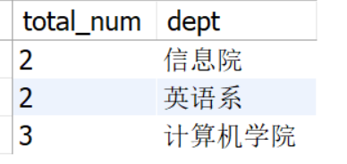

# 数据库第二次作业-冯尔宁-2022302181149
## 1. 设学生—选课数据库为表 1 至表 3，试用 SQL 语句完成以下操作：
(1) 查询考试成绩不及格的学生的学号及成绩。
```
SELECT sno, grade from s_c WHERE grade < 60;
```


(2) 查询年龄在 19~25 岁（包括 19 和 25 岁）之间的学生的姓名、院系和年龄，并按年龄的降序排序。
```
SELECT sname, dept, age from student where age between 19 and 25 order by age desc;
```


(3) 查询姓名中含“国”字的学生档案情况。
```
SELECT * from student where sname LIKE "%国%";
```


(4) 按院系查询学生总人数。
```
SELECT COUNT(*) as total_num, dept from student group by dept;
```


(5) 计算选修了 008 号课程的学生的平均成绩和最高分及最低分。
```
SELECT avg(grade) as average_grade, max(grade) as max_grade, min(grade) as min_grade from
s_c where cno = 008;
```


(6) 求平均成绩在 85 分以上（含 85）的各门课程号及平均成绩。
```
SELECT cno, avg(grade) as average_grade from s_c group by cno having avg(grade) >= 85;
```


# 2. 已知学生表 S、任课表 C 和选课表 SC，见表 4-6，试用 SQL 语句实现下列查询：

(1) 查询“张景林”老师所授课程号和课程名。
```
SELECT cno, cname from C where teacher = "张景林";
```


(2) 查询选修课程名为“C 语言”或者“数据库”的学生学号。
```
SELECT distinct sno from SC inner join C on C.cno = SC.cno
where C.cname in ("C语言", "数据库");
```


(3) 查询“高晓灵”同学所选修课程的课程号及课程名。
```
SELECT C.cno, C.cname from S
join SC on S.sno = SC.sno 
join C on C.cno = SC.cno
where S.sname = "高晓灵";
```


(4) 查询至少选修课程号为 c3 和 c4 的学生学号。
```
SELECT 	sno from SC
where SC.cno in ("c3", "c4")
group by SC.sno
having COUNT(distinct SC.cno) = 2; # 排除一个同学有重修（选了两次以上的同一节课）
```


(5) 用 EXISTS 来查询学习课程号为 c5 的学生学号与姓名。
```
SELECT S.sno, S.sname from S
where EXISTS (
	SELECT 1 from SC
    where SC.sno = S.sno
    and SC.cno = "c5"
);
```


(6) 查询不学 c2 课程的学生姓名与性别。
```
SELECT S.sname, S.gen from S
where S.sno not in (
	SELECT SC.sno from SC
    where SC.cno != "c2"
);
```


## 3. 设有以下关系：
职工：E（职工号，姓名，性别，职务，家庭地址，部门号）
部门：D（部门号，部门名称，地址，电话）
保健：B（保健号，职工号，检查日期，健康状况）
用关系代数（(1)~(4)题）、SQL 语言（(1)~(6)题）完成下列功能：


(1) 查找所有女科长的姓名和家庭地址。
```
SELECT E.name, E.address FROM E
WHERE E.gen = "女" and E.position = "科长";
```
(2) 查找部门名称为“办公室”的科长姓名和家庭地址。
```
SELECT E.name, E.address from E
join D on D.sid = E.sid
where D.name = "办公室" and E.position = "科长";
```
(3) 查找部门名为“财务科”、保健状况为“良好”的职工姓名和家庭地址。
```
SELECT E.name, E.address from E
join D on D.sid = E.sid
join B on B.sid = E.sid
where D.name = "财务科" and B.status = "良好";
```
(4) 删除职工关系表中职工号为“3016”的记录。
```
DELETE FROM E WHERE E.sid = "3016" IF EXISTS;
DELETE FROM D WHERE D.sid = "3016" IF EXISTS;
DELETE FROM B WHERE B.sid = "3016" IF EXISTS;
```
(5) 将职工号为“3016”的职工的健康状况改为“一般”。
```
UPDATE B SET B.status = "一般"
WHERE B.sid = "3016";
```
(6) 建立健康状况为“差”的职工情况的视图。
```
CREATE VIEW stuff_condition AS
SELECT * FROM E
WHERE E.sid in (
    SELECT B.sid from B
    where B.status = "差";
);
SELECT * FROM D
WHERE D.sid in (
    SELECT B.sid from B
    where B.status = "差";
);
SELECT * FROM B
WHERE B.sid in (
    SELECT B.sid from B
    where B.status = "差";
);
```